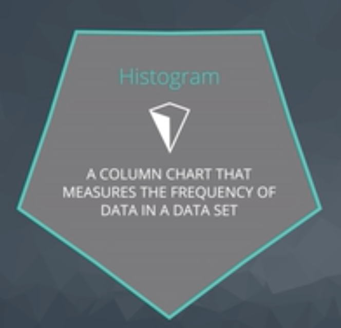
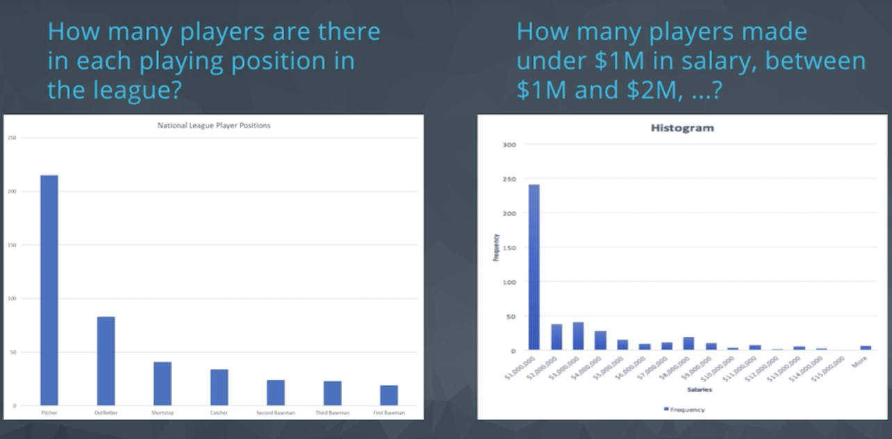
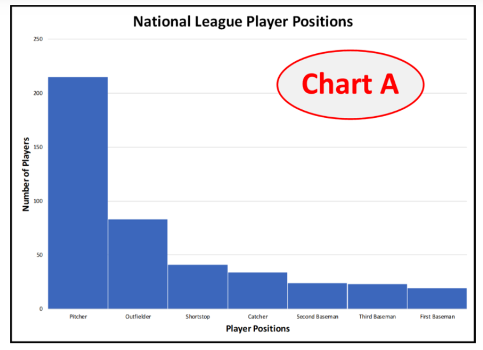
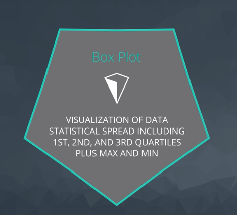
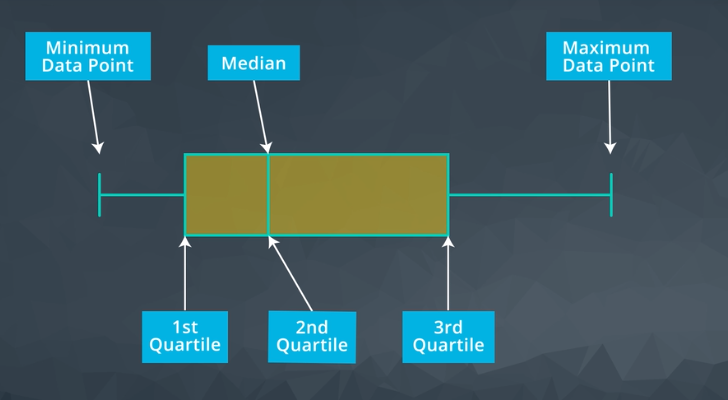
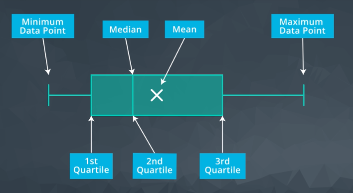
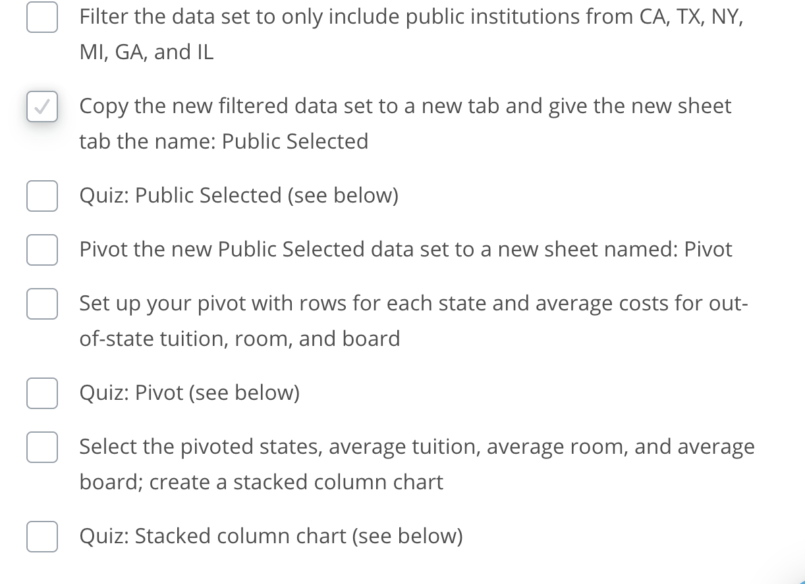
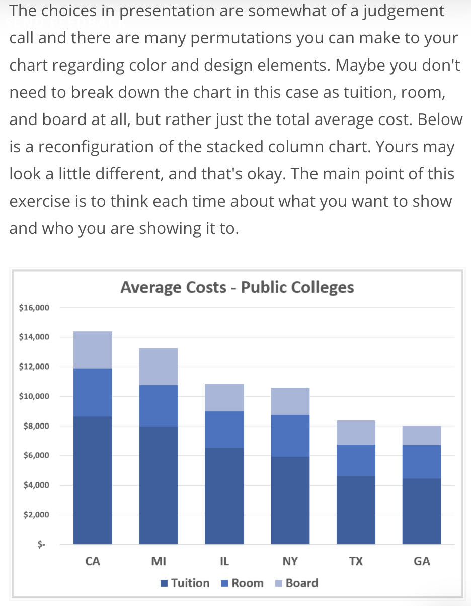

## Pie Charts
  * Used to illustrate proportionality.
  * just needs categories and value.

**Tip**
  * You can copy and transpose values.

#### Exercise: Pie Charts

In the following exercise, you'll open a spreadsheet of Financial information copied from Wikipedia containing information about the S&P 500 index companies, `sp500_companies.xlsx`. You'll use what you've learned about pivot tables and pie charts to answer questions about the data.   

[Pie Chart and Pivot Practice](./Misc/sp500-companies.xlsx)

## Bar Charts
  * Compare category values with each other.

## Scatter and Line Plots

**What chat to use?**

{:class="img-responsive"}

#### Exercise: Scatter Plots

Scatter plots are useful for displaying [bivariate](https://en.wikipedia.org/wiki/Bivariate_data) numerical data. This means a data set with two variables, such as height and weight measurements for a list of human beings.

If the data of both variables moves up together, they have a positive correlation, and this can be seen in the scatter plot, such as in the following plot of human [height and weight data](http://wiki.stat.ucla.edu/socr/index.php/SOCR_Data_Dinov_020108_HeightsWeights). We can see that generally, as height increases, so does weight. The line shown is the "trend line", which can be added in Excel by selecting the scatter chart, then `Design->Add Chart Element->Trendline->Linear`

If one variable increases as the other decreases, the two variables have a negative correlation, as in the following plot of [depth vs velocity in the Columbia River](http://www.seattlecentral.edu/qelp/sets/011/011.html):

For this exercise, open the provided spreadsheets, create scatter plots as requested, and answer the questions about the general correlation for each.

[Scatter Plot and Trend Lines](./Misc/lake-superior.xlsx)

[Scatter Plot](./Misc/puget-sound-butter-clams.xlsx)

## Histograms

**How to create a histogram? Install [Analysis ToolPak Add-in](https://support.office.com/en-us/article/Load-the-Analysis-ToolPak-6a63e598-cd6d-42e3-9317-6b40ba1a66b4)**

**Quiz: Histograms**

Histograms and Bar (or Column) charts are easily confused. **Histograms plot distributions of quantitative (numerical) data**. Numerical ranges of the data are grouped into bins and charted. **Bar or column charts plot counts of categorical data**. Consider the following two similar-looking charts and answer the quiz question.

## Box Plots

Excel gives us the mean

**Exercise: Professional Presentations**

In the following exercise, you are given a data set of information about U.S. colleges. The data set is available in the resources at the bottom of the page as `american_colleges.xlsx`, but can also be downloaded from mathforum.org, where several data sets are available for you to experiment with.

Imagine that you are given the task of preparing a graphic for a high school counselor's presentation on college choices to students and their parents. The families are just starting to look at their choices and this graphic is only one part of the talk. It's meant to show the audience that costs may vary by location. The counselor wants a comparison of costs between a few (6) example states from across the U.S.

You will create a stacked column chart that compares average costs of attending a public college among six states: California (CA), Texas (TX), New York (NY), Michigan (MI), Georgia (GA), and Illinois (IL). We'll assume that the cost we want to look at only includes the out-of-state tuition, room, and board. While preparing your chart, keep in mind the following questions from the lesson:

- What questions are you trying to answer?
  * Most costly and most cost effective?
- What patterns are you trying to show?
  * Into what degrees the cost varies?
- Who is the audience?
  * The parents and students.
- Overview or in depth?
  * Overview

[Create Chart and Pivot Table](./Misc/american-colleges.xlsx)
